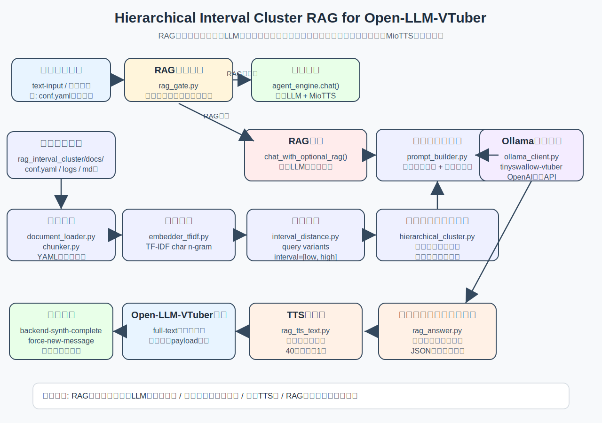

# Architecture Overview Diagram

この図は、Open-LLM-VTuber に追加した階層的区間クラスタリングRAGの全体像を示す。

- RAG対象外の通常会話は、従来どおり `agent_engine.chat()` に渡す。
- RAG対象質問だけ、通常LLMをスキップしてRAG経路に切り替える。
- RAG回答全文は画面に表示し、音声には短文だけを渡す。
- RAG回答後も `backend-synth-complete` と `force-new-message` により通常会話へ復帰する。



## 図の配置

GitHubリポジトリでは、以下の配置を想定する。

```text
docs/
├─ architecture_overview.md
└─ assets/
   └─ rag_architecture_overview.svg
```

READMEから参照する場合は、以下を追加する。

```markdown
## 構成図

全体構成は以下を参照してください。

- [docs/architecture_overview.md](docs/architecture_overview.md)

## 理論的背景

HIC-RAGの数理的な定式化については、以下を参照してください。

- [階層的区間クラスタリングRAGの数学的定式化](hierarchical_interval_clustering_rag_paper_ja.md)
```
